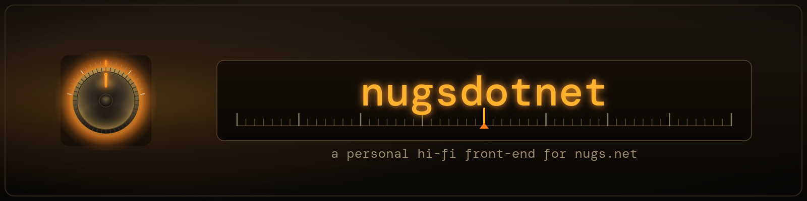

<p align="center">
  
</p>

<p align="center">
  
  
  
  
  
  
  
</p>

<p align="center"><em>A personal hi-fi front-end for <a href="https://nugs.net">nugs.net</a> live music — fast search, a real queue, keyboard-first. Three heads (web · hybrid · pure native), one identity, no DRM games.</em></p>

---

## ◖ Why this rig exists

The official nugs UI has slow search, weak queue/playlist UX, and no keyboard
shortcuts. nugsdotnet is a faster front panel for the same catalog, run against
**your own subscription**. It streams what you're entitled to and nothing more —
no content is downloaded, redistributed, or stripped of DRM. Personal use only.

### Spec sheet

| | |
|---|---|
| **Heads** | Web (Blazor WebAssembly) · Hybrid desktop (.NET MAUI Blazor) · **Pure native desktop (WinUI 3, [`native/`](native/))** |
| **Runtime** | .NET 10 · `win-x64`, self-contained |
| **Audio** | FLAC 16/44 preferred, with ALAC / MQA / AAC fallbacks · gapless on the WinUI head |
| **Auth** | nugs password grant, or a pasted `access_token` for SSO accounts |
| **Install** | per-user installer, no admin (winget manifest shipped per release) |

---

## ◖ Signal path

The web and hybrid heads render the **same** Razor UI and reach nugs through the
**same** proxy in `Nugsdotnet.Core` — the only difference is where that proxy is
hosted. The web head serves it from ASP.NET Core; the hybrid head spins up an
embedded **loopback Kestrel** so the WebView's own `<audio>`/`` elements can
stream directly (a WebView can't pull Range/206 audio through C# `HttpClient`).
The **WinUI head needs no proxy at all** — native code sets the required headers
itself and streams straight from the CDN (see *The pure-native head* below).

```
  ┌───────────────────────────────────────────────────────────────────────────┐
  │ nugs.net   ·   catalog API  +  audio / image CDN                          │
  └─────────────────────────────────────┬─────────────────────────────────────┘
                                        │  /api  (+ Referer: play.nugs.net  +  mobile User-Agent)
  ┌─────────────────────────────────────┴─────────────────────────────────────┐
  │ Nugsdotnet.Core   —   the /api proxy                                      │
  └────────────────┬─────────────────────────────────────────┬────────────────┘
                   │                                         │
  ┌────────────────┴────────────────┐       ┌────────────────┴────────────────┐
  │ WEB head                        │       │ HYBRID head                     │
  │ Blazor WASM                     │       │ MAUI Blazor Hybrid              │
  │ + ASP.NET Core host             │       │ + loopback Kestrel @127.0.0.1:0 │
  └─────────────────────────────────┘       └─────────────────────────────────┘

  both render the shared  Nugsdotnet.UI (Razor RCL)  +  Nugsdotnet.Shared (DTOs)

  (the third head — native/ WinUI 3 — talks to nugs directly, no proxy, no WebView)
```

### Why a proxy at all

The browser (and the WebView) can't talk to nugs directly for two reasons:

1. **CORS** — nugs's API doesn't permit cross-origin calls from `localhost`.
2. **Audio headers** — the audio CDN requires `Referer: play.nugs.net` and a
   mobile `User-Agent`. JS can't set those, so the proxy adds them.

| Project | Role |
|---|---|
| `Nugsdotnet.UI` | Razor components — the shared front panel (RCL), used by the web + hybrid heads |
| `Nugsdotnet.Core` | `NugsClient`, `TokenStore`, and the `/api` proxy endpoints |
| `Nugsdotnet.Shared` | DTOs |
| `Nugsdotnet.Server` | ASP.NET Core host for the web head (serves the WASM client + proxy) |
| `Nugsdotnet.Client` | Blazor WebAssembly client |
| `Nugsdotnet.App` | .NET MAUI Blazor Hybrid head + the loopback Kestrel |
| [`native/`](native/) | **Standalone WinUI 3 head** — its own solution and services, zero proxy: audio streams in-process via ranged HTTP reads |

### The pure-native head

The third head, under [`native/`](native/), skips the WebView *and* the proxy
entirely: a WinUI 3 app feeds `MediaPlayer` from an in-process
`IRandomAccessStream` that does the ranged CDN reads itself. It carries the
full RECEIVER '74 identity natively — dashboard home with a recently-played
rail, gapless playback with one-track look-ahead, a mini-player inspector with
live stream metrics, media keys/SMTC, and a custom title bar — and is compiled
by CI on `windows-latest` on every push. See
[`native/README.md`](native/README.md) for the run guide and roadmap.

---

## ◖ Power on — run the web head

You need the **.NET 10 SDK**. Then:

```powershell
# add your nugs credentials with user-secrets (preferred)
dotnet user-secrets set "Nugs:Email" "you@example.com" --project src/Nugsdotnet.Server
dotnet user-secrets set "Nugs:Password" "your-password" --project src/Nugsdotnet.Server

dotnet run --project src/Nugsdotnet.Server
```

The server binds `http://localhost:5273`. Open it, sign in (the "use credentials
from appsettings/env" checkbox is on by default), search, click through to a
show, hit ▶ on a track.

Prefer env vars? Set `NUGS_EMAIL` / `NUGS_PASSWORD` instead. **Don't** put real
credentials in `appsettings.json` — it's tracked, and this repo is public.

> **SSO accounts:** if you sign into nugs via Apple/Google, the password grant
> won't work. You'll need to paste an `access_token` grabbed from the
> play.nugs.net devtools — see `token.md` in the Nugs-Downloader repo.

---

## ◖ Off the shelf — install the native app

The native desktop build ships as a per-user installer (no admin) attached to
each [GitHub Release](../../releases). Grab the latest `…-x64-setup.exe` and run
it, or use the winget manifest bundled with the release:

```powershell
winget install --manifest .\nugsdotnet-<version>-winget-manifests
```

Full cut-a-release and install details live in
[`docs/RELEASING.md`](docs/RELEASING.md).

---

## ◖ Front panel — keyboard shortcuts

Bound at the window level (`audio-interop.js`), so they work anywhere except
inside `<input>` / `<textarea>`.

| key       | action                  |
| --------- | ----------------------- |
| `/`       | Focus the search bar    |
| `space`   | Play / pause            |
| `n`       | Next track in queue     |
| `p`       | Previous track in queue |
| `Esc`     | Blur a focused input    |

---

## ◖ On the dial — roadmap

- **v0.1** — auth, search, album & artist views, single-track playback.
- **v0.2** *(current)* — full artist landing page, queue + autoplay through
  albums, prev/next + global keyboard shortcuts, add-to-queue / play-next,
  themed native shell, winget distribution.
- **v0.3** — persistent now-playing across reloads, scrubber metadata,
  fast date-browser per artist.
- **v0.4** — library/favorites sync, history, fuzzy local search index,
  mini-player, optional offline cache.

The pure-native WinUI head tracks its own phases in
[`native/README.md`](native/README.md) — currently feature-complete through
gapless playback, with installer/winget packaging as the remaining item.

---

<details>
<summary><b>◖ Under the hood</b> — notes for hacking</summary>

<br>

- **Tokens** live in `tokens.json` next to the server (gitignored). Refresh
  happens automatically ~60s before expiry.
- **Defensive catalog parsing** — catalog endpoints return raw `JsonNode`. The
  Razor components dig fields out defensively because nugs's responses use
  inconsistent casing (`artistID` vs `ArtistID`) and pluralization. Toggle the
  `json` button in the topbar to inspect any view's raw response.
- **Audio format probe** — `platformID` for `bigriver/subPlayer.aspx`:
  `1=ALAC, 2=FLAC 16/44, 3=MQA 24/48, 4=360RA, 5=AAC 150k, 6=HLS`. We prefer
  FLAC, fall back through the probe list, and skip HLS-only tracks for now.
- **`audio-interop.js`** exists because Blazor can't call `play()`/`pause()` on a
  media element through `ElementReference` alone. It's small on purpose.
- **Native media URLs** point at the loopback Kestrel's bound port, read at call
  time so there's no startup-ordering dependency on when Kestrel finished binding.

</details>

<details>
<summary><b>◖ Reference</b> — the unofficial nugs API surface</summary>

<br>

Documented by community projects — check these when an endpoint or shape changes:

- [Sorrow446/Nugs-Downloader](https://github.com/Sorrow446/Nugs-Downloader) (Go)
- [Dniel97/orpheusdl-nugs](https://github.com/Dniel97/orpheusdl-nugs) (Python)

</details>

---

<p align="center"><sub>
Built with .NET 10 · MAUI Blazor Hybrid · ASP.NET Core — for personal use against your own nugs.net subscription. Not affiliated with nugs.net.
</sub></p>
