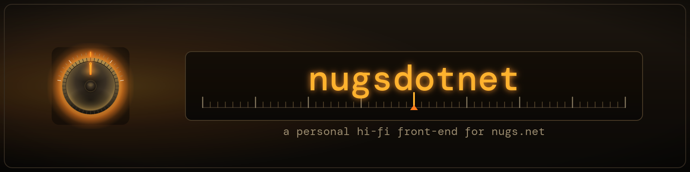

<p align="center">
  
</p>

<p align="center">
  <a href="https://github.com/tsvb/nugsdotnet/actions/workflows/native.yml"></a>
  
  
  
  
</p>

<p align="center"><em>A personal hi-fi front panel for <a href="https://nugs.net">nugs.net</a> live music.<br>
<b>WinUI 3</b> · fast search · a real queue · gapless playback · keyboard-first.</em></p>

---

## ◖ Why this rig exists

The official nugs UI has slow search, weak queue/playlist UX, and no keyboard
shortcuts. nugsdotnet is a faster front panel for the same catalog, run against
**your own subscription**. It streams what you're entitled to and nothing more —
no content is downloaded, redistributed, or stripped of DRM. Personal use only.

### Spec sheet

| | |
|---|---|
| **App** | WinUI 3 (Windows App SDK 2.2) · unpackaged, self-contained |
| **Runtime** | .NET 10 · Windows 10 2004+ / Windows 11 · x64 or arm64 |
| **Audio** | FLAC 16 preferred · ALAC / MQA / AAC fallbacks · HLS adaptive · gapless look-ahead |
| **Sign-in** | Email + password on the login card · OAuth password grant · never read from the environment |
| **At rest** | Tokens DPAPI-encrypted (`session.bin`) · stash / recents / playback scoped to the nugs account |
| **Identity** | RECEIVER '74 — warm-VFD dark/amber, custom title bar, bundled brand type |

---

## ◖ On the faceplate

| | |
|---|---|
| **Home** | Time-of-day greeting, Recently Played and Stash art rails, filterable artist chips |
| **Browse** | Artist pages, set-grouped album pages, sectioned search |
| **Transport** | Prev / −15 / play / +30 / next, scrub-safe seek, mute, lossless format badge |
| **Inspector** | `Ctrl+D` — mini player, live SIGNAL PATH metrics, UP NEXT queue |
| **Memory** | Queue + position on relaunch, remembered window / volume / mute |
| **OS** | Media keys and the Windows media flyout (SMTC) with title / artist / show / art |

The developer tour — on-disk layout, build, tests — is in
[`native/README.md`](native/README.md).

---

## ◖ Signal path

The app talks to nugs directly. Auth and catalog go to the API over HTTPS.
Audio feeds `MediaPlayer` from an in-process `IRandomAccessStream` that issues
ranged CDN GETs with the required `Referer` / `User-Agent`. Stream URLs from
the API are allowlisted to public HTTPS before anything is fetched.

```
  nugs.net API + CDN
        │
  ┌─────┴──────────────────────────────────────────────┐
  │ Nugsdotnet.Native.Core      auth · catalog · picks │   net10.0 — tested on any OS
  ├────────────────────────────────────────────────────┤
  │ Nugsdotnet.Native           WinUI 3 front panel    │   HttpAudioStream → MediaPlayer
  └────────────────────────────────────────────────────┘
```

| Project | Role |
|---|---|
| [`native/Nugsdotnet.Native.Core`](native/Nugsdotnet.Native.Core) | Auth, DPAPI session, catalog, stream resolver, local stores |
| [`native/Nugsdotnet.Native`](native/Nugsdotnet.Native) | WinUI 3 app: views, playback, imaging, RECEIVER '74 theme |
| [`native/Nugsdotnet.Native.Tests`](native/Nugsdotnet.Native.Tests) | xUnit suite for Core — cross-platform, gates CI |

---

## ◖ Off the shelf — install it

Grab the latest `nugsdotnet-<version>-x64-setup.exe` from
[Releases](https://github.com/tsvb/nugsdotnet/releases) — per-user, no admin,
self-contained (no extra .NET or runtime install). Each release also carries a
winget manifest:

```powershell
winget install --manifest .\nugsdotnet-<version>-winget-manifests
```

How a release is cut: [`docs/RELEASING.md`](docs/RELEASING.md).

---

## ◖ Power on — run from source

Requires the **.NET 10 SDK** on Windows. The Windows App SDK arrives via NuGet.

```powershell
dotnet run --project native\Nugsdotnet.Native\Nugsdotnet.Native.csproj -c Release -p:Platform=x64 -p:RuntimeIdentifier=win-x64
```

Sign in with your nugs.net email and password. Tokens are then encrypted at
rest; the password is not stored.

### Front panel — keyboard shortcuts

| key          | action         |
| ------------ | -------------- |
| `Ctrl+F`     | Focus search   |
| `Ctrl+Space` | Play / pause   |
| `Ctrl+→`     | Next track     |
| `Ctrl+←`     | Previous track |
| `Ctrl+D`     | Toggle dashboard |

Media keys and the Windows media flyout work too.

---

## ◖ On the dial — next

- **Code signing** — Azure Trusted Signing, so SmartScreen stops warning on the installer.
- **Stash sync** — only if nugs ever exposes a favorites API (none documented today).

---

<p align="center"><sub>
Built with .NET 10 · WinUI 3 · Windows App SDK — for personal use against your own nugs.net subscription. Not affiliated with nugs.net.
</sub></p>
